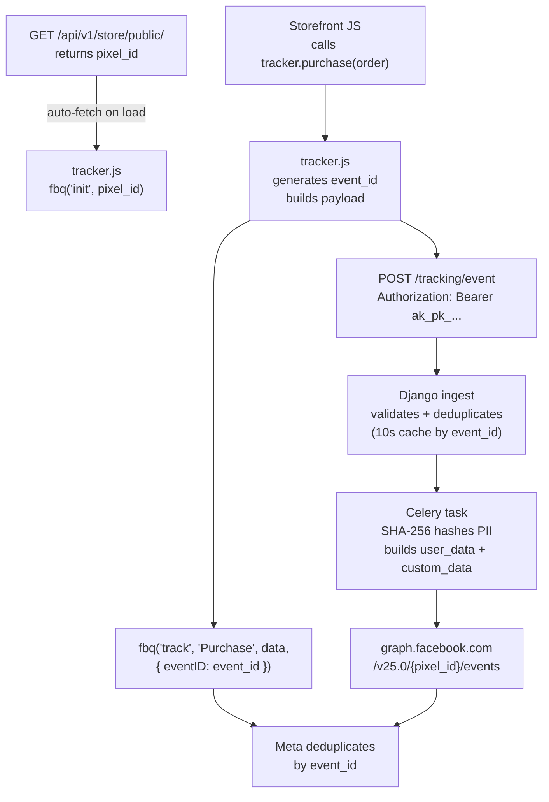
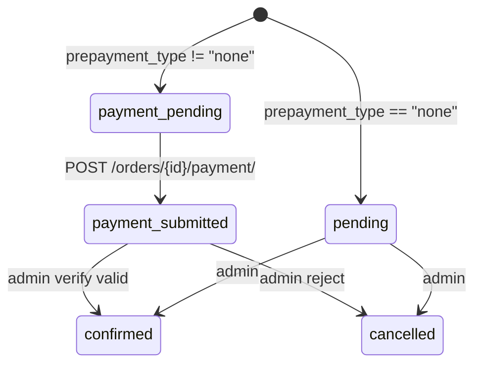

# Paperbase Storefront API — Frontend Integration Prompt

You are building a storefront frontend that integrates with the Paperbase multi-tenant
BaaS API. This document is the **single source of truth** for every request the frontend
may issue against the storefront. If something is not listed here, it does not exist.

## STRICT RULES

- **DO NOT** invent endpoints, fields, or query params.
- **DO NOT** assume data shapes — use exactly what is documented below.
- **ALL** requests **MUST** include the `Authorization: Bearer ak_pk_<key>` header.
- **ONLY** publishable keys (`ak_pk_...`) are accepted. Secret keys (`ak_sk_...`) are rejected with `403`.
- **DO NOT** use `PUT`, `PATCH`, or `DELETE` — the storefront surface only exposes `GET` and `POST`.
- **DO NOT** send unknown fields in any request body — `POST /api/v1/orders/` rejects unknown top-level fields with `400`.
- **DO NOT** use internal numeric IDs — always use prefixed `public_id` strings (see section 4).
- **DO NOT** fire Meta Pixel / CAPI events yourself — the supplied `tracker.js` handles that.

---

## 1. API Overview

| Setting         | Value                                    |
| --------------- | ---------------------------------------- |
| **Base URL**    | `{BACKEND_ORIGIN}/api/v1/`               |
| **Auth method** | Bearer token (publishable API key)       |
| **Key prefix**  | `ak_pk_...`                              |
| **Response**    | Bare JSON (never wrapped in `{ "data" }`) |
| **Page size**   | 24 items per page (paginated endpoints)  |

### Required headers

| Header           | Value                          | When                                    |
| ---------------- | ------------------------------ | --------------------------------------- |
| `Authorization`  | `Bearer ak_pk_<key>`           | **Every** request                       |
| `Content-Type`   | `application/json`             | `POST` with JSON body                   |
| `Content-Type`   | `multipart/form-data`          | `POST /support/tickets/` with file uploads |

### Store resolution

The tenant store is resolved entirely from the publishable API key. Do **not** send a
store ID, domain header, or user session token — none exist.

---

## 2. Authentication Flow

There is no login, session, or user token on the storefront. A store customer is
always anonymous from the API's perspective.

1. The store owner provisions a publishable API key in the dashboard.
2. The storefront embeds this key at build / server-render time. It is public and
   safe to ship to the browser.
3. Every storefront API call sends `Authorization: Bearer ak_pk_<key>`.
4. The server resolves the tenant store from the key; rejections are described in
   section 10.

There are no "protected routes" in the storefront sense — every storefront endpoint
below **requires** the API key. Conversely, no storefront endpoint ever accepts a
user JWT.

---

## 3. Response Envelopes

### Paginated list

Used by `GET /products/`, `GET /products/search/`, `GET /categories/` (flat mode).

```json
{
  "count": 42,
  "next": "https://api.example.com/api/v1/products/?page=2",
  "previous": null,
  "results": [ ...items ]
}
```

- `next` / `previous` are absolute URLs or `null`.
- Page size is fixed at `24`.

### Unpaginated array

Used by banners, notifications, shipping zones, shipping options, related products,
categories (tree mode).

```json
[ ...items ]
```

### Single object

Used by store public, product detail, category detail, pricing preview, pricing
breakdown, shipping preview, search, order create, order payment submit, support
ticket create.

```json
{ ...fields }
```

---

## 4. ID Prefix Reference

Always use these prefixed string IDs. Never send raw numeric IDs.

| Prefix  | Entity            |
| ------- | ----------------- |
| `prd_`  | Product           |
| `cat_`  | Category          |
| `var_`  | Variant           |
| `img_`  | Product image     |
| `atr_`  | Attribute         |
| `atv_`  | Attribute value   |
| `ban_`  | Banner            |
| `blg_`  | Blog post         |
| `btg_`  | Blog tag          |
| `szn_`  | Shipping zone     |
| `smt_`  | Shipping method   |
| `srt_`  | Shipping rate     |
| `ord_`  | Order             |
| `tkt_`  | Support ticket    |
| `cta_`  | Notification      |

---

## 5. Data Type Rules

| Context                                     | Type            | Example                            |
| ------------------------------------------- | --------------- | ---------------------------------- |
| Most monetary fields                        | string decimal  | `"599.00"`                         |
| `price_range.min` / `max` (catalog filters) | float           | `99.0`                             |
| `cost_rules` fields (shipping zones)        | float           | `60.0`                             |
| All timestamps                              | ISO 8601 string | `"2025-06-01T00:00:00+06:00"`      |

---

## 6. Complete Endpoint List

No other endpoints exist. Do not call any path not listed below.

| # | Method | Path                                              | Purpose                                   |
| - | ------ | ------------------------------------------------- | ----------------------------------------- |
| 1 | GET    | `/api/v1/store/public/`                           | Store branding and public config          |
| 2 | GET    | `/api/v1/products/`                               | List products (paginated)                 |
| 3 | GET    | `/api/v1/products/<identifier>/`                  | Single product detail (id or slug)        |
| 4 | GET    | `/api/v1/products/<identifier>/related/`          | Related products for a product           |
| 5 | GET    | `/api/v1/products/search/`                        | Product-only search (paginated)           |
| 6 | GET    | `/api/v1/categories/`                             | List categories (flat or tree)            |
| 7 | GET    | `/api/v1/categories/<slug>/`                      | Single category by slug                   |
| 8 | GET    | `/api/v1/catalog/filters/`                        | Filter sidebar metadata                   |
| 9 | GET    | `/api/v1/banners/`                                | Active promotional banners                |
| 10| GET    | `/api/v1/notifications/active/`                   | Active CTA notifications                  |
| 11| GET    | `/api/v1/shipping/zones/`                         | Shipping zones with merged cost rules     |
| 12| GET    | `/api/v1/shipping/options/`                       | Shipping methods for a zone               |
| 13| POST   | `/api/v1/shipping/preview/`                       | Server-side shipping quote                |
| 14| POST   | `/api/v1/pricing/preview/`                        | Single-product pricing preview            |
| 15| POST   | `/api/v1/pricing/breakdown/`                      | Full-cart pricing breakdown               |
| 16| POST   | `/api/v1/orders/`                                 | Create an order                           |
| 17| POST   | `/api/v1/orders/<public_id>/payment/`             | Submit transaction for a prepayment order |
| 18| GET    | `/api/v1/search/`                                 | Combined product + category search        |
| 19| POST   | `/api/v1/support/tickets/`                        | Submit a support ticket                   |
| 20| GET    | `/api/v1/blogs/`                                  | Published blog posts list                 |
| 21| GET    | `/api/v1/blogs/<public_id>/`                      | Published blog post detail                |
| 22| POST   | `/tracking/event`                                 | (Fired by bundled `tracker.js` only)      |

> There is **no** `POST /api/v1/orders/initiate-checkout/`, no `GET /api/v1/orders/...`
> for customers, no cart endpoint, and no logout / login endpoint. The cart lives
> entirely in client state (see section 12).

---

## 7. Endpoints — Full Specification

### 7.1 GET `/api/v1/store/public/` — Store config

Returns store branding, currency, SEO defaults, tracker script versioning, social
links, policy URLs, and the custom product-field schema.

**Query params:** none.

**Response `200`:**

```json
{
  "store_name": "My Store",
  "logo_url": "https://api.example.com/media/stores/str_xxx/logo/main.png",
  "currency": "BDT",
  "currency_symbol": "৳",
  "country": "BD",
  "support_email": "help@mystore.com",
  "phone": "01712345678",
  "address": "123 Main St, Dhaka",
  "extra_field_schema": [
    {
      "id": "warranty",
      "entityType": "product",
      "name": "Warranty",
      "fieldType": "text",
      "required": false,
      "order": 1,
      "options": []
    }
  ],
  "modules_enabled": { "products": true, "orders": true, "customers": true },
  "tracker_build_id": "2026041801",
  "tracker_script_src": "https://storage.paperbase.me/static/tracker.js?v=2026041801",
  "tracking_ingest_endpoint": "https://api.paperbase.me/tracking/event",
  "pixel_id": "1234567890123456",
  "theme_settings": { "primary_color": "#2563eb" },
  "seo": {
    "default_title": "My Store - Best Products",
    "default_description": "Shop the best products online"
  },
  "policy_urls": {
    "returns": "https://mystore.com/returns",
    "refund": "https://mystore.com/refund",
    "privacy": "https://mystore.com/privacy"
  },
  "social_links": {
    "facebook": "https://facebook.com/mystore",
    "instagram": "https://instagram.com/mystore",
    "whatsapp": "",
    "tiktok": ""
  }
}
```

**Fields:**

| Field | Type | Notes |
|---|---|---|
| `store_name` | string | Store display name |
| `logo_url` | string \| null | Absolute URL to logo |
| `currency` | string | ISO currency code (e.g. `"BDT"`) |
| `currency_symbol` | string | e.g. `"৳"` (may be empty string) |
| `country` | string | Country code (may be empty string) |
| `support_email` | string | Contact email (may be empty string) |
| `phone` | string | Store phone (may be empty string) |
| `address` | string | Physical address (may be empty string) |
| `extra_field_schema` | array | Filtered to entries with `entityType == "product"` |
| `modules_enabled` | object | Boolean feature flags keyed by module id |
| `tracker_build_id` | string | Versioning token for `tracker.js` (pass-through from server) |
| `tracker_script_src` | string | Versioned `tracker.js` URL — use this verbatim |
| `tracking_ingest_endpoint` | string | Where `tracker.js` POSTs events (informational) |
| `pixel_id` | string \| null | Meta Pixel ID for this store. `null` when no active Facebook integration is configured in the dashboard. Read by `tracker.js` automatically — **the storefront does not need to use this field directly**. |
| `theme_settings.primary_color` | string | Hex color (may be empty string) |
| `seo.default_title` | string | Default page title |
| `seo.default_description` | string | Default meta description |
| `policy_urls.returns` / `refund` / `privacy` | string | Policy URLs (may be empty) |
| `social_links` | object | 4 keys are **always** present: `facebook`, `instagram`, `whatsapp`, `tiktok`. Missing links are empty strings. |

**Errors:** auth-only (section 10).

---

### 7.2 GET `/api/v1/products/` — Product list

**Query params:**

| Param | Type | Description |
|---|---|---|
| `page` | int | Page number (default `1`) |
| `category` | string | Category slug(s), comma-separated; descendants are included automatically |
| `brand` | string | Brand name(s), comma-separated |
| `search` | string | Text search across name, description, brand |
| `price_min` | decimal string | Minimum price filter |
| `price_max` | decimal string | Maximum price filter |
| `attributes` | string | Attribute value `public_id`s (e.g. `atv_xl01`), comma-separated |
| `ordering` **or** `sort` | string | One of `newest` (default), `price_asc`, `price_desc`, `popularity` |

> If both `ordering` and `sort` are provided, `ordering` wins. Unknown values fall
> back to the default (display order, then name).

**Response `200`:**

```json
{
  "count": 42,
  "next": "https://api.example.com/api/v1/products/?page=2",
  "previous": null,
  "results": [
    {
      "public_id": "prd_abc123",
      "name": "Premium T-Shirt",
      "brand": "BrandX",
      "price": "599.00",
      "original_price": "799.00",
      "image_url": "https://api.example.com/media/.../main.jpg",
      "category_public_id": "cat_def456",
      "category_slug": "clothing",
      "category_name": "Clothing",
      "slug": "premium-t-shirt",
      "stock_status": "in_stock",
      "available_quantity": 50,
      "variant_count": 3,
      "extra_data": { "warranty": "1 year" },
      "prepayment_type": "none"
    }
  ]
}
```

**Product list item fields:**

| Field | Type | Notes |
|---|---|---|
| `public_id` | string | Prefix: `prd_` |
| `name` | string | Product name |
| `brand` | string \| null | Brand name |
| `price` | string decimal | Current selling price |
| `original_price` | string decimal \| null | `null` if no discount |
| `image_url` | string \| null | Main product image URL |
| `category_public_id` | string | Prefix: `cat_` |
| `category_slug` | string | Category URL slug |
| `category_name` | string | Category display name |
| `slug` | string | Product URL slug (unique per store) |
| `stock_status` | string | `"in_stock"`, `"low_stock"`, or `"out_of_stock"` |
| `available_quantity` | integer | Aggregate stock (variants sum if any, else base inventory) |
| `variant_count` | integer | Number of active variants |
| `extra_data` | object | Custom fields per store schema (see `extra_field_schema`) |
| `prepayment_type` | string | `"none"`, `"delivery_only"`, or `"full"` (see section 13) |

---

### 7.3 GET `/api/v1/products/<identifier>/` — Product detail

`<identifier>` is either a `prd_...` public id **or** a product slug (detected
automatically by prefix).

**Response `200`:**

```json
{
  "public_id": "prd_abc123",
  "name": "Premium T-Shirt",
  "brand": "BrandX",
  "stock_tracking": true,
  "slug": "premium-t-shirt",
  "price": "599.00",
  "original_price": "799.00",
  "image_url": "https://api.example.com/media/.../main.jpg",
  "images": [
    {
      "public_id": "img_xyz789",
      "image_url": "https://api.example.com/media/.../gallery-1.jpg",
      "alt": "Front view",
      "order": 0
    }
  ],
  "category_public_id": "cat_def456",
  "category_slug": "clothing",
  "category_name": "Clothing",
  "description": "A premium cotton t-shirt...",
  "stock_status": "in_stock",
  "available_quantity": 50,
  "variants": [
    {
      "public_id": "var_ghi012",
      "sku": "MYSTR-A1B2C3",
      "available_quantity": 20,
      "stock_status": "in_stock",
      "price": "599.00",
      "options": [
        {
          "attribute_public_id": "atr_size01",
          "attribute_slug": "size",
          "attribute_name": "Size",
          "value_public_id": "atv_xl01",
          "value": "XL"
        }
      ]
    }
  ],
  "extra_data": { "warranty": "1 year" },
  "prepayment_type": "none",
  "breadcrumbs": ["Home", "Clothing", "Premium T-Shirt"],
  "related_products": [ /* up to 4 product list items */ ],
  "variant_matrix": {
    "size": {
      "slug": "size",
      "attribute_public_id": "atr_size01",
      "attribute_name": "Size",
      "values": [
        { "value_public_id": "atv_m01", "value": "M" },
        { "value_public_id": "atv_xl01", "value": "XL" }
      ]
    }
  }
}
```

**Additional fields beyond list item:**

| Field | Type | Notes |
|---|---|---|
| `stock_tracking` | boolean | Whether stock is tracked for this product |
| `description` | string | Full product description |
| `images` | array | Gallery images sorted by `order`, then id |
| `variants` | array | Active product variants only |
| `breadcrumbs` | string[] | Always starts with `"Home"` and ends with the product name |
| `related_products` | array | Up to 4 related product list items (same category, excludes self) |
| `variant_matrix` | object | Keys = attribute slug; values = option rollups (see shape above). Empty object if the product has no variants. |

**Image object:**

| Field | Type | Notes |
|---|---|---|
| `public_id` | string | Prefix: `img_` |
| `image_url` | string \| null | Absolute URL |
| `alt` | string | Alt text |
| `order` | integer | Display order |

**Variant object:**

| Field | Type | Notes |
|---|---|---|
| `public_id` | string | Prefix: `var_` |
| `sku` | string | Stock keeping unit |
| `available_quantity` | integer | Stock for this variant |
| `stock_status` | string | `"in_stock"`, `"low_stock"`, or `"out_of_stock"` |
| `price` | string decimal | Variant effective price |
| `options` | array | Attribute-value pairs for this variant |

**Variant option object:**

| Field | Type | Notes |
|---|---|---|
| `attribute_public_id` | string | Prefix: `atr_` |
| `attribute_slug` | string | e.g. `"size"`, `"color"` |
| `attribute_name` | string | e.g. `"Size"`, `"Color"` |
| `value_public_id` | string | Prefix: `atv_` |
| `value` | string | e.g. `"XL"`, `"Red"` |

**Errors:**
- `404` — product not found or inactive.

---

### 7.4 GET `/api/v1/products/<identifier>/related/` — Related products

Returns up to 4 related products (same category, excluding the current product).
Unpaginated array. Each item has the exact shape of a product list item (7.2).

**Response `200`:**

```json
[ { ...product_list_item }, ... ]
```

**Errors:**
- `404` — product not found.

---

### 7.5 GET `/api/v1/products/search/` — Product-only search (paginated)

**Query params:**

| Param | Required | Notes |
|---|---|---|
| `q` | yes (effectively) | Minimum 2 characters. Shorter queries return `count: 0, results: []`. |
| `page` | no | Page number |

Search matches `name`, `brand`, and `description` (case-insensitive).

**Response `200`:** Paginated envelope (section 3) whose `results` are product list items.

---

### 7.6 GET `/api/v1/categories/` — Categories (flat or tree)

**Query params:**

| Param | Values | Effect |
|---|---|---|
| `tree` | `"1"`, `"true"`, `"yes"` | Return a hierarchical tree (unpaginated array) |
| `parent` | category slug | Flat mode only: return direct children of the given slug. Omit for top-level categories. |
| `page` | int | Flat mode only |

> `parent` is ignored in tree mode. In flat mode, omitting `parent` returns only
> top-level categories (those with `parent_public_id === null`).

**Flat response — paginated:**

```json
{
  "count": 5,
  "next": null,
  "previous": null,
  "results": [
    {
      "public_id": "cat_def456",
      "name": "Clothing",
      "slug": "clothing",
      "description": "All clothing items",
      "image_url": "https://api.example.com/media/.../cat.jpg",
      "parent_public_id": null,
      "order": 0
    }
  ]
}
```

**Tree response (`?tree=1`) — unpaginated array:**

```json
[
  {
    "public_id": "cat_def456",
    "name": "Clothing",
    "slug": "clothing",
    "description": "All clothing items",
    "image_url": "...",
    "parent_public_id": null,
    "order": 0,
    "children": [
      {
        "public_id": "cat_ghi789",
        "name": "T-Shirts",
        "slug": "t-shirts",
        "description": "",
        "image_url": null,
        "parent_public_id": "cat_def456",
        "order": 0,
        "children": []
      }
    ]
  }
]
```

**Category fields:**

| Field | Type | Notes |
|---|---|---|
| `public_id` | string | Prefix: `cat_` |
| `name` | string | Display name |
| `slug` | string | URL slug (unique per store) |
| `description` | string | Category description |
| `image_url` | string \| null | Absolute URL |
| `parent_public_id` | string \| null | Parent ID; `null` = top-level |
| `order` | integer | Display order among siblings |
| `children` | array | Tree mode only — nested child categories |

---

### 7.7 GET `/api/v1/categories/<slug>/` — Category detail

Returns a single category object in the same shape as the flat list item (no
`children`).

**Errors:**
- `404` — category not found or inactive.

---

### 7.8 GET `/api/v1/catalog/filters/` — Filter sidebar metadata

Aggregate metadata for building a filter sidebar. Only categories / attributes /
brands / price bounds that appear on **active** products are returned.

**Response `200`:**

```json
{
  "categories": [
    { "public_id": "cat_abc", "name": "Clothing", "slug": "clothing" },
    { "public_id": "cat_def", "name": "Accessories", "slug": "accessories" }
  ],
  "attributes": {
    "size": [
      { "public_id": "atv_s01", "value": "S" },
      { "public_id": "atv_m01", "value": "M" },
      { "public_id": "atv_l01", "value": "L" }
    ],
    "color": [
      { "public_id": "atv_red01", "value": "Red" },
      { "public_id": "atv_blue01", "value": "Blue" }
    ]
  },
  "brands": ["BrandX", "BrandY"],
  "price_range": { "min": 99.0, "max": 5999.0 }
}
```

**Fields:**

| Field | Type | Notes |
|---|---|---|
| `categories` | array | Each: `{ public_id, name, slug }` — includes ancestors of categories used by products |
| `attributes` | object | Keys = attribute slug; values = `[{ public_id, value }]` of attribute values used by active variants |
| `brands` | string[] | Distinct non-empty brand names, sorted |
| `price_range.min` | float | Minimum product price (`0.0` if the catalog is empty) |
| `price_range.max` | float | Maximum product price (`0.0` if the catalog is empty) |

> `price_range` values are **float** (not string decimal). Use them as slider bounds.

---

### 7.9 GET `/api/v1/banners/` — Active banners

Active, in-schedule banners for the tenant.

**Query params:**

| Param | Type | Notes |
|---|---|---|
| `slot` | string | Optional. If provided, must be one of `home_top`, `home_bottom`. |

**Response `200`:**

```json
[
  {
    "public_id": "ban_abc123",
    "title": "Summer Sale - 30% Off",
    "image_url": "https://api.example.com/media/.../banner.jpg",
    "cta_text": "Shop Now",
    "cta_url": "https://mystore.com/sale",
    "order": 0,
    "placement_slots": ["home_top"],
    "start_at": "2025-06-01T00:00:00+06:00",
    "end_at": "2025-06-30T23:59:59+06:00"
  }
]
```

**Fields:**

| Field | Type | Notes |
|---|---|---|
| `public_id` | string | Prefix: `ban_` |
| `title` | string | Banner title |
| `image_url` | string \| null | Banner image URL |
| `cta_text` | string | Button text |
| `cta_url` | string | Button link (may be empty string) |
| `order` | integer | Display order (sort ascending) |
| `placement_slots` | string[] | One or more of `home_top`, `home_bottom` |
| `start_at` | string \| null | ISO 8601 schedule start |
| `end_at` | string \| null | ISO 8601 schedule end |

**Rendering rules:**
- The backend only returns banners that are both `is_active` and currently within
  their schedule window — no client-side schedule check is needed.
- Filter banners client-side by `placement_slots`, or pass `?slot=home_top` / etc. to
  the API.
- A banner may appear in multiple slots.
- Sort by `order` ascending.

**Errors:**
- `400 { "slot": "Invalid placement slot selected" }` — unknown slot value.

---

### 7.10 GET `/api/v1/notifications/active/` — Active CTA notifications

Unpaginated array.

**Response `200`:**

```json
[
  {
    "public_id": "cta_abc123",
    "cta_text": "Free shipping on orders over ৳500!",
    "notification_type": "promo",
    "cta_url": "https://mystore.com/promo",
    "cta_label": "Learn More",
    "order": 0,
    "is_active": true,
    "is_currently_active": true,
    "start_at": "2025-01-01T00:00:00+06:00",
    "end_at": null
  }
]
```

**Fields:**

| Field | Type | Notes |
|---|---|---|
| `public_id` | string | Prefix: `cta_` |
| `cta_text` | string | Display text (max 500 chars) |
| `notification_type` | string | `"banner"`, `"alert"`, or `"promo"` |
| `cta_url` | string \| null | Link URL |
| `cta_label` | string | Link text |
| `order` | integer | Display order |
| `is_active` | boolean | Admin toggle |
| `is_currently_active` | boolean | `is_active` **and** inside schedule window |
| `start_at` | string \| null | ISO 8601 |
| `end_at` | string \| null | ISO 8601 |

> Only render notifications where `is_currently_active === true`. The list already
> filters on `is_active`, but the schedule window is evaluated client-side.

---

### 7.11 GET `/api/v1/shipping/zones/` — Shipping zones

All active shipping zones with merged cost rules. Unpaginated array.

**Response `200`:**

```json
[
  {
    "zone_public_id": "szn_dhaka01",
    "name": "Inside Dhaka",
    "estimated_days": "1-2",
    "is_active": true,
    "created_at": "2025-01-15T10:30:00+06:00",
    "updated_at": "2025-03-20T14:00:00+06:00",
    "cost_rules": [
      { "min_order_total": 0.0, "shipping_cost": 60.0 },
      { "min_order_total": 500.0, "shipping_cost": 0.0 }
    ]
  }
]
```

**Zone fields:**

| Field | Type | Notes |
|---|---|---|
| `zone_public_id` | string | Prefix: `szn_` |
| `name` | string | Zone display name |
| `estimated_days` | string | Display text like `"1-2"` (may be empty string) |
| `is_active` | boolean | Always `true` in this response |
| `created_at` | string \| null | ISO 8601 |
| `updated_at` | string \| null | ISO 8601 |
| `cost_rules` | array | Price brackets derived from the zone's active rates |

**Cost rule fields:**

| Field | Type | Notes |
|---|---|---|
| `min_order_total` | float | Minimum subtotal for this rule |
| `max_order_total` | float | **Optional** — omitted when unbounded |
| `shipping_cost` | float | Shipping cost for this bracket |

---

### 7.12 GET `/api/v1/shipping/options/` — Shipping methods for a zone

**Query params:**

| Param | Required | Notes |
|---|---|---|
| `zone_public_id` | **yes** | Shipping zone ID (prefix `szn_`) |
| `order_total` | no | Decimal string. If provided, only rates whose `min/max_order_total` match are returned. |

**Response `200`:**

```json
[
  {
    "rate_public_id": "srt_abc123",
    "method_public_id": "smt_def456",
    "method_name": "Standard Delivery",
    "method_type": "standard",
    "method_order": 0,
    "zone_public_id": "szn_dhaka01",
    "zone_name": "Inside Dhaka",
    "price": "60.00",
    "rate_type": "flat",
    "min_order_total": null,
    "max_order_total": null
  }
]
```

**Fields:**

| Field | Type | Notes |
|---|---|---|
| `rate_public_id` | string | Prefix: `srt_` |
| `method_public_id` | string | Prefix: `smt_` — **this** is what you send in an order body |
| `method_name` | string | Display name |
| `method_type` | string | `"standard"`, `"express"`, `"pickup"`, or `"other"` |
| `method_order` | integer | Display order |
| `zone_public_id` | string | Zone identifier |
| `zone_name` | string | Zone display name |
| `price` | string decimal | Shipping cost |
| `rate_type` | string | `"flat"`, `"weight"`, or `"order_total"` |
| `min_order_total` | string decimal \| null | Minimum order total for this rate |
| `max_order_total` | string decimal \| null | Maximum order total for this rate |

**Errors:**
- `400 { "detail": "zone_public_id is required." }` — missing param.

---

### 7.13 POST `/api/v1/shipping/preview/` — Server-side shipping quote

**Request body:**

```json
{
  "zone_public_id": "szn_dhaka01",
  "items": [
    {
      "product_public_id": "prd_abc123",
      "variant_public_id": "var_ghi012",
      "quantity": 2
    }
  ]
}
```

| Field | Required | Notes |
|---|---|---|
| `zone_public_id` | **yes** | Active shipping zone |
| `items` | **yes** | Non-empty array |
| `items[].product_public_id` | **yes** | Must be an active product (`prd_...`) |
| `items[].variant_public_id` | conditional | Required if the product has active variants; must be empty otherwise |
| `items[].quantity` | **yes** | Integer, must be `> 0` |

**Response `200`:**

```json
{
  "shipping_cost": "60.00",
  "estimated_days": "1-2",
  "currency": "BDT"
}
```

**Errors:**

| Status | Body | When |
|---|---|---|
| 400 | `{ "zone_public_id": ["This field is required."] }` | `zone_public_id` blank |
| 400 | `{ "detail": "items must be a non-empty list." }` | `items` missing or empty |
| 400 | `{ "detail": "Invalid product_public_id or quantity in items." }` | Product unknown/inactive or quantity ≤ 0 |
| 400 | `{ "zone_public_id": "Unknown or inactive shipping zone." }` | Zone unknown |
| 400 | `{ "error": "Variant selection required for this product" }` | Product has variants but none was sent |
| 400 | `{ "error": "Invalid or inactive variant for this product." }` | Variant id unknown for the product |

---

### 7.14 POST `/api/v1/pricing/preview/` — Single-product pricing preview

**Request body:**

```json
{
  "product_public_id": "prd_abc123",
  "variant_public_id": "var_ghi012",
  "quantity": 2,
  "shipping_zone_public_id": "szn_dhaka01",
  "shipping_method_public_id": "smt_def456"
}
```

| Field | Required | Notes |
|---|---|---|
| `product_public_id` | **yes** | Active product (`prd_...`) |
| `variant_public_id` | conditional | Required if the product has active variants |
| `quantity` | no | Integer, default `1`, min `1` |
| `shipping_zone_public_id` | no | Include to price shipping; ignored if unknown/inactive |
| `shipping_method_public_id` | no | Optional — lets you force a specific method |

**Response `200`:**

```json
{
  "base_subtotal": "1198.00",
  "shipping_cost": "60.00",
  "final_total": "1258.00",
  "lines": [
    {
      "product_public_id": "prd_abc123",
      "quantity": 2,
      "unit_price": "599.00",
      "line_subtotal": "1198.00"
    }
  ]
}
```

**Errors:**

| Status | Body | When |
|---|---|---|
| 404 | `{ "detail": "Product not found or unavailable." }` | Product unknown/inactive |
| 400 | `{ "product_public_id": "This field is required." }` | Missing id |
| 400 | `{ "error": "Variant selection required for this product" }` | Product has variants but none was sent |
| 400 | `{ "error": "Invalid or inactive variant for this product." }` | Variant id mismatch |

> If `shipping_zone_public_id` is omitted or unknown, `shipping_cost` will be `"0.00"`
> and `final_total` will equal `base_subtotal`. This endpoint never returns `400`
> for a missing / unknown shipping zone — it just skips the shipping portion.

---

### 7.15 POST `/api/v1/pricing/breakdown/` — Full-cart pricing

**Request body:**

```json
{
  "items": [
    { "product_public_id": "prd_abc123", "variant_public_id": "var_ghi012", "quantity": 2 },
    { "product_public_id": "prd_xyz789", "quantity": 1 }
  ],
  "shipping_zone_public_id": "szn_dhaka01",
  "shipping_method_public_id": "smt_def456"
}
```

| Field | Required | Notes |
|---|---|---|
| `items` | **yes** | Non-empty array |
| `items[].product_public_id` | **yes** | Active product (`prd_...`) |
| `items[].variant_public_id` | conditional | Required if the product has active variants |
| `items[].quantity` | **yes** | Integer, must be `> 0` |
| `shipping_zone_public_id` | **yes** | Active zone for the store |
| `shipping_method_public_id` | no | Optional override |

> Unlike `/pricing/preview/`, `shipping_zone_public_id` is **mandatory** here and
> the endpoint returns `400` if blank or unknown.

**Response `200`:** Same shape as `/pricing/preview/` (`base_subtotal`,
`shipping_cost`, `final_total`, `lines[]`).

**Errors:**

| Status | Body | When |
|---|---|---|
| 400 | `{ "items": "At least one item is required." }` | Missing / empty |
| 400 | `{ "items": "Invalid product_public_id or quantity." }` | Bad line |
| 400 | `{ "shipping_zone_public_id": "This field is required." }` | Missing zone |
| 400 | `{ "shipping_zone_public_id": "Invalid or inactive shipping zone." }` | Unknown zone |

---

### 7.16 POST `/api/v1/orders/` — Create order

Stateless checkout: the entire cart lives in the request body. Unknown top-level
fields return `400` immediately.

**Request body:**

```json
{
  "shipping_zone_public_id": "szn_dhaka01",
  "shipping_method_public_id": "smt_def456",
  "shipping_name": "John Doe",
  "phone": "01712345678",
  "email": "john@example.com",
  "shipping_address": "123 Main St, Dhaka",
  "district": "Dhaka",
  "products": [
    { "product_public_id": "prd_abc123", "quantity": 2, "variant_public_id": "var_ghi012" },
    { "product_public_id": "prd_xyz789", "quantity": 1 }
  ]
}
```

**Allowed fields (these and **only** these):**

| Field | Required | Validation |
|---|---|---|
| `shipping_zone_public_id` | **yes** | Must be an active zone for this store |
| `shipping_method_public_id` | no | Must be an active method for this store, if sent |
| `shipping_name` | **yes** | Non-empty, max 255 chars |
| `phone` | **yes** | Exactly 11 digits, starts with `01`, numbers only (server strips non-digits) |
| `email` | no | Valid email format; may be blank |
| `shipping_address` | **yes** | Non-empty |
| `district` | no | Max 100 chars |
| `products` | **yes** | Minimum 1 item |
| `products[].product_public_id` | **yes** | Must start with `prd_`; must be active |
| `products[].quantity` | **yes** | Integer, 1–1000 inclusive |
| `products[].variant_public_id` | conditional | Required if the product has active variants; must be absent otherwise |

Inside each `products[]` entry, any key other than `product_public_id`, `quantity`,
`variant_public_id` returns `400`.

**Response `201 Created`:**

```json
{
  "public_id": "ord_abc123",
  "order_number": "ORD-00001",
  "status": "pending",
  "payment_status": "none",
  "prepayment_type": "none",
  "requires_payment": false,
  "transaction_id": null,
  "payer_number": null,
  "customer_name": "John Doe",
  "phone": "01712345678",
  "shipping_address": "123 Main St, Dhaka",
  "items": [
    {
      "product_name": "Premium T-Shirt",
      "quantity": 2,
      "unit_price": "599.00",
      "total_price": "1198.00",
      "variant_details": "Size: XL, Color: Red"
    }
  ],
  "subtotal": "1198.00",
  "shipping_cost": "60.00",
  "total": "1258.00"
}
```

**Response fields (always present):**

| Field | Type | Notes |
|---|---|---|
| `public_id` | string | Prefix: `ord_` |
| `order_number` | string | Human-readable, e.g. `"ORD-00001"` |
| `status` | string | `"pending"` when no prepayment; `"payment_pending"` when prepayment required |
| `payment_status` | string | `"none"`, `"submitted"`, `"verified"`, or `"failed"` — on creation always `"none"` |
| `prepayment_type` | string | Strongest-wins cart-level type: `"none"`, `"delivery_only"`, or `"full"` |
| `requires_payment` | boolean | `true` iff `prepayment_type !== "none"` (drives the post-checkout routing) |
| `transaction_id` | string \| null | Customer-submitted tx id (always `null` on creation) |
| `payer_number` | string \| null | Customer-submitted payer phone (always `null` on creation) |
| `customer_name` | string | From `shipping_name` |
| `phone` | string | Customer phone (digits-only) |
| `shipping_address` | string | Delivery address |
| `items[].product_name` | string | Frozen product name at order time |
| `items[].quantity` | integer | Ordered quantity |
| `items[].unit_price` | string decimal | Price per unit at order time |
| `items[].total_price` | string decimal | `unit_price × quantity` (line total) |
| `items[].variant_details` | string \| null | e.g. `"Size: XL, Color: Red"` |
| `subtotal` | string decimal | Merchandise subtotal (post-discount) |
| `shipping_cost` | string decimal | Shipping cost |
| `total` | string decimal | Grand total |

**Errors:**

| Status | Body | When |
|---|---|---|
| 400 | `{ "detail": "Unknown fields are not allowed: <names>." }` | Unknown top-level field |
| 400 | `{ "detail": "No products provided." }` | `products` missing/empty |
| 400 | `{ "products": ["Invalid product public_id."] }` | Bad `prd_` id |
| 400 | `{ "products": ["Product prd_xxx not found or unavailable."] }` | Unknown product |
| 400 | `{ "products": ["Unknown product fields are not allowed: ..."] }` | Disallowed key in a line |
| 400 | `{ "phone": ["Phone must be 11 digits, start with 01, and contain only numbers."] }` | Bad phone |
| 400 | `{ "shipping_name": ["Required."] }` | Blank `shipping_name` (or `shipping_address`) |
| 400 | `{ "shipping_zone_public_id": ["Invalid pk ..."] }` | Zone not in this store / inactive |
| 400 | `{ "detail": "Stock validation failed.", "errors": ["Insufficient stock for X. Available: 5, Requested: 10"] }` | Stock shortfall |
| 400 | `{ "error": "Variant selection required for this product" }` / `{ "error": "Invalid or inactive variant for this product." }` | Variant rule violations |

> Throttling: direct order creation is additionally limited to `30/hour` per client
> (see section 10).

---

### 7.17 POST `/api/v1/orders/<public_id>/payment/` — Submit prepayment transaction

Called only for orders whose creation response had `requires_payment === true`.

**Request body:**

```json
{
  "transaction_id": "TRX-9876543210",
  "payer_number": "01710000000"
}
```

| Field | Required | Notes |
|---|---|---|
| `transaction_id` | **yes** | Non-empty, trimmed; max 100 chars |
| `payer_number` | **yes** | Non-empty, trimmed; max 32 chars |

**Response `200`:** Same shape as the order-creation receipt (section 7.16) with
`payment_status` now `"submitted"` and the submitted `transaction_id` /
`payer_number` echoed back.

**Errors:**

| Status | Body | When |
|---|---|---|
| 404 | `{ "detail": "Not found." }` | Order does not belong to this store |
| 400 | `{ "transaction_id": ["Required."] }` / `{ "payer_number": ["Required."] }` | Blank field |
| 400 | `{ "detail": "Order is not awaiting payment submission." }` | Order status is not `payment_pending` |
| 400 | `{ "detail": "Payment has already been submitted for this order." }` | Already in `submitted` / `verified`; only `failed` allows re-submission |

> Also throttled by the same `30/hour` direct-order limiter.

---

### 7.18 GET `/api/v1/search/` — Combined product + category search

**Query params:**

| Param | Required | Notes |
|---|---|---|
| `q` | conditional | Minimum 2 characters. Shorter queries return empty products/categories/suggestions. |
| `trending` | no | `"1"`, `"true"`, or `"yes"` — ignores `q` and returns top 12 products by popularity |

**Response `200`:**

```json
{
  "products": [ /* up to 10 product list items */ ],
  "categories": [ /* up to 8 category objects (flat shape, no children) */ ],
  "suggestions": ["Premium T-Shirt", "Clothing"],
  "trending": false
}
```

| Field | Type | Notes |
|---|---|---|
| `products` | array | Max 10 product list items (12 when `trending=1`) |
| `categories` | array | Max 8 category items (empty when `trending=1`) |
| `suggestions` | string[] | Up to 10 name suggestions (empty when `trending=1`) |
| `trending` | boolean | Mirrors whether the response was served in trending mode |

> For **paginated** product-only search, use `GET /api/v1/products/search/?q=` instead.

---

### 7.19 POST `/api/v1/support/tickets/` — Submit support ticket

**Content-Type:** use `application/json` for text-only; switch to `multipart/form-data`
only when sending `attachments`.

**Request body:**

```json
{
  "name": "John Doe",
  "email": "john@example.com",
  "phone": "01712345678",
  "subject": "Order not received",
  "message": "I placed order ORD-00001 a week ago...",
  "order_number": "ORD-00001",
  "category": "order",
  "priority": "medium"
}
```

| Field | Required | Validation |
|---|---|---|
| `name` | **yes** | Max 255 chars |
| `email` | **yes** | Valid email |
| `phone` | no | Max 20 chars |
| `subject` | no | Max 255 chars |
| `message` | **yes** | Free-form text |
| `order_number` | no | Max 64 chars |
| `category` | no | `"general"` (default), `"order"`, `"payment"`, `"shipping"`, `"product"`, `"technical"`, `"other"` |
| `priority` | no | `"low"`, `"medium"` (default), `"high"`, `"urgent"` |
| `attachments` | no | File uploads, `multipart/form-data` only. Send as repeated `attachments` fields. |

**Response `201 Created`:**

```json
{
  "public_id": "tkt_abc123",
  "name": "John Doe",
  "email": "john@example.com",
  "phone": "01712345678",
  "subject": "Order not received",
  "message": "I placed order ORD-00001 a week ago...",
  "order_number": "ORD-00001",
  "category": "order",
  "priority": "medium",
  "status": "new",
  "created_at": "2025-04-07T15:30:00+06:00",
  "updated_at": "2025-04-07T15:30:00+06:00"
}
```

> `status` is always `"new"` on creation.

---

### 7.20 GET `/api/v1/blogs/` — Published blog posts

Returns posts that are **live** for the storefront: `published_at` is set,
`published_at` is not in the future (relative to server time), `is_public` is
true, and the row is not soft-deleted. There is no `status` field on the model
or in API payloads — use `published_at` (and `is_public`) as the source of truth.
Storefront-side deletion (soft delete) is transparent to this endpoint.

**Feature gate:** returns `403 Forbidden` when the store has
`modules_enabled.blog !== true`. No posts are leaked when the Blog module is
disabled, even for an authenticated storefront API key.

**Query parameters (optional):**

| Param | Type | Purpose |
| ----- | ---- | ------- |
| `tag` | string | Filter by tag slug (e.g. `updates`) |

**Response `200 OK`:**

```json
[
  {
    "public_id": "blg_abc123",
    "title": "Our summer sale is here",
    "slug": "our-summer-sale-is-here",
    "excerpt": "Big deals on every category…",
    "featured_image_url": "https://storage.paperbase.me/.../featured.jpg",
    "meta_title": "Summer sale 2026",
    "meta_description": "Up to 50% off across…",
    "tags": [
      { "public_id": "btg_sale01", "name": "Sale", "slug": "sale" }
    ],
    "is_featured": true,
    "views": 1243,
    "published_at": "2026-04-20T10:30:00+06:00"
  }
]
```

| Field                | Type            | Notes                                                  |
| -------------------- | --------------- | ------------------------------------------------------ |
| `public_id`          | string          | Prefix: `blg_`                                         |
| `tags[].public_id`   | string          | Prefix: `btg_`                                         |
| `featured_image_url` | string \| null  | Absolute URL to the featured image, or `null` if unset |
| `published_at`       | ISO 8601 \| null| Non-null for every row in this list (posts with a null timestamp never appear here) |

The list is not paginated — the backend applies tenant-scoped caching and
returns the full published set. Storefronts should render the array directly.

---

### 7.21 GET `/api/v1/blogs/<public_id>/` — Blog post detail

`<public_id>` must be the `blg_...` identifier (slugs are not accepted here).
Returns the full post including `content` and `author_name`, and increments the
`views` counter on each call. The same **live** visibility rules as §7.20 apply
(`published_at`, `is_public`, not soft-deleted).

**Feature gate:** same as §7.20 — returns `403 Forbidden` when
`modules_enabled.blog !== true`.

**Response `200 OK`:**

```json
{
  "public_id": "blg_abc123",
  "title": "Our summer sale is here",
  "slug": "our-summer-sale-is-here",
  "excerpt": "Big deals on every category…",
  "featured_image_url": "https://storage.paperbase.me/.../featured.jpg",
  "meta_title": "Summer sale 2026",
  "meta_description": "Up to 50% off across…",
  "tags": [{ "public_id": "btg_sale01", "name": "Sale", "slug": "sale" }],
  "is_featured": true,
  "views": 1244,
  "published_at": "2026-04-20T10:30:00+06:00",
  "content": "…full body (markdown or HTML as written by the store)…",
  "author_name": "Alex Chen"
}
```

| Field          | Type            | Notes                                                         |
| -------------- | --------------- | ------------------------------------------------------------- |
| `content`      | string          | Stored verbatim — storefront decides markdown vs HTML rendering |
| `author_name`  | string          | May be empty string if the author account was deleted         |

Returns `404 Not Found` when the post has no `published_at`, has a future
`published_at`, is marked non-public, is soft-deleted, or does not belong to
the resolved store.

> Inline images inside `content` are not stored on Paperbase — storefronts
> should expect external image URLs in the body.

---

## 8. Meta Pixel + CAPI Tracking

Do **not** hand-roll Meta Pixel or Conversions API calls. Every storefront must
load the bundled `tracker.js`. It handles:

- Loading Meta's `fbevents.js` and calling `fbq("init", pixelId)` automatically
- Firing browser-side Pixel events (`fbq("track", ...)`)
- Forwarding every event to your Django backend (`POST /tracking/event`)
- Generating a shared `event_id` used by both Pixel and CAPI for deduplication
- SHA-256 hashing all PII server-side before it reaches Meta

The store owner **never needs to configure a Pixel ID on the storefront**. The Pixel
ID, Meta access token, and all CAPI credentials are managed exclusively in the
Paperbase dashboard.

---

### 8.1 What the storefront must provide

The storefront needs exactly **two things** to fully activate tracking:

1. **Load `tracker.js`** on every page
2. **Expose the publishable API key** to the browser before the script runs

That is all. The Pixel ID is fetched automatically.

---

### 8.2 Loading `tracker.js`

Always use the versioned URL returned by `GET /api/v1/store/public/`:

```html
<!-- Read tracker_script_src from /store/public/ and render it here -->
<script src="https://storage.paperbase.me/static/tracker.js?v=2026041801" async></script>
```

- Read `tracker_script_src` from the API response — do **not** hardcode the URL.
  The `?v=<BUILD_ID>` query string busts the browser cache on each deployment.
- Load it on **every page** — including product pages, cart, checkout, and the
  order confirmation / thank-you page.

---

### 8.3 Providing the API key

Set the publishable API key **before** or **immediately after** `tracker.js` loads.
Use any one of these two methods — they are equivalent:

**Method A — global variable (recommended for SSR / Next.js):**

```html
<script>
  window.PAPERBASE_PUBLISHABLE_KEY = "ak_pk_xxxxxxxxxxxxxxxx";
</script>
<!-- tracker.js script tag follows -->
```

**Method B — `tracker.init()` call:**

```js
tracker.init({ apiKey: "ak_pk_xxxxxxxxxxxxxxxx" });
```

> If none of these are set, `tracker.js` skips Pixel initialization and all
> backend POSTs return `401`. No tracking data reaches Meta.

**Optional init parameters:**

| Parameter | Type | Default | Notes |
|---|---|---|---|
| `apiKey` | string | `""` | Publishable key (`ak_pk_...`) |
| `currency` | string | `"BDT"` | Default currency code used when not passed per-event |
| `debug` | boolean | `false` | Logs all events to `console.log` when `true` |
| `endpoint` | string | `"https://api.paperbase.me/tracking/event"` | Do not change |
| `pixelId` | string | `""` | Only needed if you want to override the Pixel ID from the dashboard |

---

### 8.4 How Pixel ID is resolved (automatic)

The storefront does **not** need to know or configure the Pixel ID.

`tracker.js` resolves it automatically in this order, stopping at the first match:

1. **Manual override** — `window.PAPERBASE_PIXEL_ID` (checked synchronously at load time):
   If this global is set before `tracker.js` runs, it is used immediately and
   the API fetch is skipped entirely. Use this only if you need to bypass the
   dashboard value. Set it before the script tag:
   - `window.PAPERBASE_PIXEL_ID = "1234567890";`
   - or pass it to `tracker.init({ pixelId: "1234567890" })` (sets the same global)

2. **`GET /api/v1/store/public/`** (fetched asynchronously using the API key):
   Reads the `pixel_id` field from the response. This value comes from the
   active Facebook integration configured in the Paperbase dashboard. **This is
   the normal path** — nothing needs to be set on the storefront.

If `pixel_id` is `null` from the API (no active Facebook integration in the
dashboard), the browser Pixel is not initialized. CAPI continues to fire normally
using the dashboard credentials — it does not depend on the browser Pixel ID.

---

### 8.5 Automatic events

`tracker.js` fires these events **automatically** with no storefront code required:

| Event | When fired | Storefront action required |
|---|---|---|
| `PageView` | Immediately when `tracker.js` loads on any page | None |

---

### 8.6 Events the storefront must fire manually

Call these methods at the correct moment in your UI. All parameters marked
"optional" may be omitted entirely — the tracker handles missing data gracefully.

---

#### `tracker.viewContent(product)`

Fire when a user lands on a product detail page.

```js
tracker.viewContent({
  id: "prd_abc123",       // string — product public_id, id, publicId, or sku (any one)
  value: 599,             // number — selling price
  currency: "BDT",        // string — ISO currency code (optional, defaults to tracker currency)
  customer: {             // object — optional, only if user is known (e.g. returning customer)
    email: "user@example.com",
    phone: "01712345678",
    first_name: "John",
    last_name: "Doe",
    external_id: "cust_abc123",
    city: "Dhaka",
    state: "Dhaka",
    zip_code: "1212",
    country: "BD",
  }
});
```

> `customer` is entirely optional. If the user is browsing anonymously, omit it.
> All `customer` fields are optional individually. Provide only what you have.

---

#### `tracker.addToCart(product)`

Fire when a user clicks "Add to Cart" for a product. The cart lives in client
state — this event fires at the click moment using the data you already have.

```js
tracker.addToCart({
  id: "prd_abc123",       // string — product public_id, id, publicId, or sku
  value: 599,             // number — unit price
  currency: "BDT",        // string — optional
  customer: { ... }       // object — optional, same shape as viewContent
});
```

---

#### `tracker.initiateCheckout(cart)`

Fire when a user navigates to the checkout page / opens the checkout flow.

```js
tracker.initiateCheckout({
  value: 1258,            // number — total cart value including shipping
  currency: "BDT",        // string — optional
  items: [                // array — cart line items
    {
      id: "prd_abc123",   // string — product public_id, id, publicId, or sku
      quantity: 2,
      item_price: 599,    // number — unit price (also accepted as "price")
    },
    {
      id: "prd_xyz789",
      quantity: 1,
      item_price: 60,
    }
  ],
  customer: { ... }       // object — optional; populate if user has entered name/phone
});
```

> `items` entries accept `id`, `product_id`, `public_id`, `publicId`, or `sku` for
> the product identifier — use whichever you have in your cart state.

---

#### `tracker.purchase(order)`

Fire on the order confirmation / thank-you page, after `POST /api/v1/orders/`
returns `201`. Use the order receipt from the API response to populate this.

```js
// receipt = response from POST /api/v1/orders/
tracker.purchase({
  order_id: receipt.public_id,   // string — ord_... public id
  value: Number(receipt.total),  // number — grand total
  currency: "BDT",               // string — optional
  items: receipt.items.map(function(line) {
    return {
      id: line.product_public_id || line.product_name,  // use public_id if available
      quantity: line.quantity,
      item_price: Number(line.unit_price),
    };
  }),
  customer: {                    // populate from the order form the user just submitted
    email: form.email,           // optional — include if collected at checkout
    phone: form.phone,
    first_name: form.shipping_name.split(" ")[0],
    last_name: form.shipping_name.split(" ").slice(1).join(" "),
    city: form.district,
    country: "BD",
  }
});
```

> `customer` fields are hashed with SHA-256 on your server before being sent to
> Meta. They are sent over HTTPS to your backend only. They are never stored in
> any database. Never include raw PII in logs.

---

### 8.7 Complete event flow



---

### 8.8 PII and customer data security

- PII fields (`email`, `phone`, `first_name`, `last_name`, `external_id`, `city`,
  `state`, `zip_code`, `country`) are sent **over HTTPS to your backend only**.
- They are **SHA-256 hashed** on the server before being forwarded to Meta's
  Conversions API. Raw values never leave your server.
- They are **never stored** in any database table. The ingest pipeline is
  pass-through: serializer → Celery task payload → hash → CAPI → discard.
- Never log PII fields in your frontend. Never send them to any analytics service
  other than Paperbase tracking.

---

### 8.9 Accepted events

Only these five event names are accepted by the backend. Any other name is rejected
with `400`:

| Event | Fired by |
|---|---|
| `PageView` | Automatically on every page load |
| `ViewContent` | `tracker.viewContent(product)` |
| `AddToCart` | `tracker.addToCart(product)` |
| `InitiateCheckout` | `tracker.initiateCheckout(cart)` |
| `Purchase` | `tracker.purchase(order)` |

---

### 8.10 Deduplication

`tracker.js` is the sole source of `event_id`. The same `event_id` is used for:

- The browser Pixel call: `fbq("track", ..., { eventID: event_id })`
- The backend POST body: `{ "event_id": "event_Purchase_1714000000000_XyZ..." }`
- The CAPI payload sent to Meta: `{ "event_id": "..." }`

Meta deduplicates the browser and server events into a single signal using this
shared ID. Do not generate your own `event_id`. Do not modify the payload.

---

### 8.11 Full bootstrapping pattern (Next.js example)

```tsx
// app/layout.tsx  (or _app.tsx / root layout)
// 1. Fetch store config once (server-side or on mount)
const store = await fetch(`${BACKEND}/api/v1/store/public/`, {
  headers: { Authorization: `Bearer ${API_KEY}` }
}).then(r => r.json());

// 2. Inject the API key as a global before tracker.js loads
// 3. Load tracker.js from the versioned URL returned by the API
```

```html
<!-- In your <head> — key MUST come before tracker.js -->
<script>
  window.PAPERBASE_PUBLISHABLE_KEY = "ak_pk_xxxxxxxxxxxxxxxx";
</script>
<script src="{store.tracker_script_src}" async></script>
```

```tsx
// Product detail page — fire ViewContent on mount
useEffect(() => {
  window.tracker?.viewContent({
    id: product.public_id,
    value: Number(product.price),
    currency: store.currency,
  });
}, [product.public_id]);

// Add to cart button handler
function handleAddToCart(product) {
  addToLocalCart(product);           // your local cart logic
  window.tracker?.addToCart({
    id: product.public_id,
    value: Number(product.price),
    currency: store.currency,
  });
}

// Checkout page — fire InitiateCheckout on mount
useEffect(() => {
  window.tracker?.initiateCheckout({
    value: cartTotal,
    currency: store.currency,
    items: cart.map(line => ({
      id: line.product_public_id,
      quantity: line.quantity,
      item_price: Number(line.price),
    })),
  });
}, []);

// Order confirmation page — fire Purchase after successful order creation
const receipt = await apiFetch("/orders/", { method: "POST", body: ... });
window.tracker?.purchase({
  order_id: receipt.public_id,
  value: Number(receipt.total),
  currency: store.currency,
  items: receipt.items.map(line => ({
    id: line.product_public_id || line.product_name,
    quantity: line.quantity,
    item_price: Number(line.unit_price),
  })),
  customer: {
    email: form.email || "",
    phone: form.phone || "",
    first_name: form.shipping_name.split(" ")[0] || "",
    last_name: form.shipping_name.split(" ").slice(1).join(" ") || "",
    city: form.district || "",
    country: "BD",
  },
});
```

---

### 8.12 Do NOTs

- Do **not** manually call `fbq(...)` — `tracker.js` owns all Pixel calls.
- Do **not** manually POST to `/tracking/event` — `tracker.js` does this.
- Do **not** configure a Pixel ID on the storefront — it is read from the dashboard automatically.
- Do **not** hardcode `tracker.js` URL — always read `tracker_script_src` from `/store/public/`.
- Do **not** generate or override `event_id` — doing so breaks deduplication.
- Do **not** duplicate the `<script>` tag for `tracker.js` on the same page.
- Do **not** send `customer` PII to any other service — it goes to your backend only.

---

### 8.13 Troubleshooting

| Symptom | Cause | Fix |
|---|---|---|
| No events in Meta Events Manager | API key not set before `tracker.js` loads | Set `window.PAPERBASE_PUBLISHABLE_KEY` before the script tag |
| Browser Pixel not firing (CAPI works) | No active Facebook integration in dashboard, or `pixel_id` is `null` | Add Facebook integration via the Paperbase dashboard settings |
| `401` on ingest endpoint | Missing or invalid `ak_pk_` key | Confirm the publishable key is correct and not a secret key (`ak_sk_`) |
| Duplicate events in Meta | `tracker.js` loaded twice on the same page | Ensure the script tag appears exactly once per page |
| `Purchase` event missing | Thank-you page loads before `tracker.js` | Ensure `tracker.js` is in the root layout, not just product pages |
| Low Event Match Quality in Meta | No `customer` object passed to `purchase()` | Populate `customer` with at least `email` and `phone` from the checkout form |
| Debug: see what tracker fires | — | `tracker.init({ apiKey: "...", debug: true })` — logs to browser console |

---

## 9. Cross-Endpoint Field Name Quirks

The shipping-zone field name **differs** depending on the endpoint. Using the wrong
name returns `400`.

| Endpoint | Field name |
|---|---|
| `POST /orders/` (body) | `shipping_zone_public_id` |
| `POST /pricing/preview/` (body) | `shipping_zone_public_id` |
| `POST /pricing/breakdown/` (body) | `shipping_zone_public_id` |
| `POST /shipping/preview/` (body) | `zone_public_id` |
| `GET /shipping/options/` (query) | `zone_public_id` |
| `GET /shipping/zones/` (response) | `zone_public_id` (per row) |

Same rule for the shipping method id:

| Endpoint | Field name |
|---|---|
| `POST /orders/`, `POST /pricing/*` (body) | `shipping_method_public_id` |
| `GET /shipping/options/` (response) | `method_public_id` |

---

## 10. Error Response Formats

### Field-level validation error

```json
{ "field_name": ["Error message."] }
```

### Detail error

```json
{ "detail": "A valid storefront API key is required." }
```

### Stock validation error

```json
{
  "detail": "Stock validation failed.",
  "errors": ["Insufficient stock for Product X. Available: 5, Requested: 10"]
}
```

### Unknown fields error

```json
{ "detail": "Unknown fields are not allowed: unknown_field." }
```

### Auth errors (every endpoint)

| Scenario | Status | Body |
|---|---|---|
| Missing API key | 401 | `{ "detail": "No API key found" }` |
| Invalid / unknown API key | 401 | `{ "detail": "No API key found" }` |
| Secret key (`ak_sk_...`) used on storefront | 403 | `{ "detail": "Secret API keys cannot access storefront endpoints." }` |
| Store is inactive | 403 | `{ "detail": "Store is not active." }` |
| Too many invalid key attempts | 429 | `{ "detail": "Too many invalid API key attempts." }` + `Retry-After: 60` header |

### Rate limits

| Limit | Default | Response |
|---|---|---|
| Per IP per minute (storefront aggregate) | 100 | 429 |
| Per API key per minute (aggregate) | 5000 | 429 |
| Invalid-key attempts per fingerprint per minute | 60 | 429 + `Retry-After: 60` |
| `POST /orders/` and `POST /orders/<id>/payment/` (direct order throttle) | 30/hour | 429 |

---

## 11. Feature-Based Endpoint Grouping

### Catalog
- Products — 7.2, 7.3, 7.4, 7.5
- Categories — 7.6, 7.7
- Filter sidebar — 7.8
- Combined search — 7.18

### Merchandising
- Banners — 7.9
- CTA notifications — 7.10

### Shipping
- Zones — 7.11
- Methods for a zone — 7.12
- Server-side preview — 7.13

### Pricing & Checkout
- Single-product preview — 7.14
- Full-cart breakdown — 7.15
- Create order — 7.16
- Submit prepayment — 7.17

### Support & Tracking
- Support tickets — 7.19
- Tracker script & ingest — 7.1 (`tracker_*` fields) + section 8

### Platform
- Store config — 7.1

No admin / orders-read / users / auth / payments endpoints exist on the storefront
API. Any admin capability that might look related is exposed at `/api/v1/admin/...`
and requires a dashboard JWT; publishable API keys are denied with `403`.

---

## 12. Cart — Client-side only

There is **no** cart API. Manage the cart in client state (localStorage, Zustand,
Redux, etc.). Everything the server needs is sent in the order / pricing request
bodies.

**Recommended cart item structure:**

```json
{
  "product_public_id": "prd_abc123",
  "variant_public_id": "var_ghi012",
  "quantity": 2,
  "name": "Premium T-Shirt",
  "price": "599.00",
  "image_url": "https://...",
  "variant_details": "Size: XL, Color: Red"
}
```

Only `product_public_id`, `variant_public_id`, and `quantity` are sent to the API.
The rest (`name`, `price`, `image_url`, `variant_details`) are stored locally for
display only and must never be trusted as authoritative — the backend re-prices on
every server call.

**Cart merging rules (recommended, enforced by the API validators):**

- Merge lines by `(product_public_id, variant_public_id ?? "")`. Do not emit two
  lines for the same variant — bump `quantity` instead.
- A product with active variants **must** have a `variant_public_id` in every line.
  A product without variants must **not** have one.
- Quantity must be an integer in `[1, 1000]`.

**Variant selection logic:**

1. Read `product.variants[].options` from product detail.
2. Group options by `attribute_slug` (use `product.variant_matrix` to short-circuit).
3. When the user picks a value per attribute, find the variant whose `options` match
   every selected `value_public_id`.
4. Use that variant's `price` and `stock_status`; fall back to the product-level
   values if no variant is selected yet.

**Stock display:**

| `stock_status` | UI behaviour |
|---|---|
| `"in_stock"` | Normal add-to-cart button |
| `"low_stock"` | Show low-stock warning; allow purchase |
| `"out_of_stock"` | Disable add-to-cart; show out-of-stock state |

On a `400` with `"detail": "Stock validation failed."`, read `errors[]` and display
each message to the user. Reduce quantity or drop the item accordingly.

---

## 13. Data Consistency Rules

### 13.1 Order lifecycle

An order's lifecycle is driven by two independent fields: `status` and
`payment_status`.

| `prepayment_type` | Initial `status` | Initial `payment_status` | `requires_payment` |
|---|---|---|---|
| `none` | `pending` | `none` | `false` |
| `delivery_only` | `payment_pending` | `none` | `true` |
| `full` | `payment_pending` | `none` | `true` |

Transitions observable from the storefront:

- **No prepayment**: admin confirms → `status: confirmed`, or cancels → `status: cancelled`.
- **Prepayment required**:
  - Customer calls `POST /orders/<id>/payment/` → `payment_status: submitted` (status stays `payment_pending`).
  - Admin verifies → `status: confirmed`, `payment_status: verified`.
  - Admin rejects → `status: cancelled`, `payment_status: failed`; stock is restored. The customer may create a **new** order.



`payment_submitted` is a composite label (`status == "payment_pending"`,
`payment_status == "submitted"`) — it is **not** a distinct `status` value.

There is no storefront endpoint to poll order state. To observe verification
outcomes, rely on the confirmation email / server-sent notification issued by the
admin.

### 13.2 Prepayment resolution (strongest-wins)

Per-product `prepayment_type` values in a multi-line cart resolve to the effective
type as:

```
full > delivery_only > none
```

The server computes this automatically from the cart's products. The response
`prepayment_type` reflects the resolved value; do **not** try to compute it client
side for the final checkout decision — use the value returned from `POST /orders/`.

### 13.3 Payment submission semantics

- Exactly one submission per order, unless the previous attempt transitioned to
  `payment_status: failed` (in which case resubmission is allowed).
- If the server replies `400` with
  `"Payment has already been submitted for this order."`, show a neutral "already
  submitted — waiting for admin review" screen. Do not treat it as a hard error.
- Re-reading the order over the storefront API is not supported; provide the
  customer with their `public_id` / `order_number` and advise them to wait.

### 13.4 Variant rules (server-enforced)

- If a product has at least one active variant, every line referring to it **must**
  include a `variant_public_id`. Missing → `400 { "error": "Variant selection required for this product" }`.
- If a product has no active variants, a line referring to it **must not** include
  a `variant_public_id`. Ignoring this raises `400 { "error": "Invalid or inactive variant for this product." }`.
- Variant pricing overrides product pricing (`variant.price` is the effective
  price). Treat the product-level `price` as the "from" price when a product has
  variants at different price points.

### 13.5 Shipping cost

- For display on a product page: call `POST /pricing/preview/` with
  `shipping_zone_public_id` to get an accurate shipping estimate, or omit the zone
  to preview merchandise-only totals.
- For cart / checkout: call `POST /pricing/breakdown/` (zone **required**) or
  `POST /shipping/preview/` after the shipping zone has been chosen.
- The final authoritative shipping cost is the one returned in the order-create
  response. Do not trust `price` values from `/shipping/options/` as the final
  cost — it does not evaluate the `min/max_order_total` brackets against the
  current cart subtotal the way `/shipping/preview/` does.

### 13.6 Pagination

- `count` is the total number of items across pages, `next` / `previous` are
  absolute URLs or `null`. Do not hand-build `?page=N` URLs; always follow
  `next` / `previous`.
- Page size is fixed at `24`. You cannot change it.

### 13.7 Caching hints

Many responses are cached server-side (store public, products list/detail, related,
categories, catalog filters, banners, notifications, shipping options). You do not
need to invalidate anything — the backend does this automatically on admin writes.
Treat the responses as safe to cache in-browser for short windows if you wish.

---

## 14. Frontend Integration Notes

### 14.1 Bootstrapping

1. Read `GET /store/public/` once per session (or per SSR). Cache locally.
2. Set `window.PAPERBASE_PUBLISHABLE_KEY = "ak_pk_..."` **before** the tracker
   script runs — this must be first or `PageView` fires without a key.
3. Inject `<script src="{tracker_script_src}" async></script>` using the
   `tracker_script_src` URL from the API response verbatim. The Pixel ID is
   fetched automatically from the dashboard; you do not need to configure it on
   the storefront.
4. `PageView` fires automatically when the script loads — no call required.
5. Call the remaining tracker methods at the correct UI moments (section 8.6).

### 14.2 Catalog screens

- Home / category pages: `GET /products/` with category / brand / attribute /
  price filters.
- Search bar: debounce + `GET /search/` (combined) for autocomplete; `GET
  /products/search/` for a dedicated paginated results page.
- Product detail: `GET /products/<slug>/` — the response already ships
  `related_products`, `breadcrumbs`, and `variant_matrix`, so a single request
  covers the whole page.
- Filter sidebar: `GET /catalog/filters/`. Re-read whenever the catalog scope
  changes (e.g. user switches category), not on every keystroke.

### 14.3 Cart and pricing

- Cart is entirely local (section 12).
- For live totals, call `POST /pricing/breakdown/` on cart changes. Always include
  `shipping_zone_public_id` — it is required here.
- Before placing the order, keep the last `POST /pricing/breakdown/` response in
  memory so you can detect discrepancies against the `POST /orders/` response.

### 14.4 Checkout

Step-by-step flow:

| Step | Action | API call |
|---|---|---|
| 1 | Load store config on boot | `GET /store/public/` |
| 2 | Browse catalog | `GET /products/`, `GET /categories/`, `GET /catalog/filters/` |
| 3 | View product detail | `GET /products/<id>/` |
| 4 | Add to cart | *(local state only)* |
| 5 | Load shipping zones | `GET /shipping/zones/` |
| 6 | User picks zone → load methods | `GET /shipping/options/?zone_public_id=...` |
| 7 | Live cart totals | `POST /pricing/breakdown/` (zone required, method optional) |
| 8 | Customer enters name / phone / address | *(local state only)* |
| 9 | Submit order | `POST /orders/` |
| 10| Read receipt from `201` response | *(no extra call)* |
| 11a | If `requires_payment === false` → show "order received" | *(no API call)* |
| 11b | If `requires_payment === true` → route to payment screen and submit | `POST /orders/<public_id>/payment/` |
| 12| Show "awaiting verification" state if prepayment | *(no polling endpoint exists)* |

There is no "initiate checkout" API call. The Meta `InitiateCheckout` event is
fired automatically by `tracker.js` when the user navigates to the checkout route.

### 14.5 Prepayment UX checklist

- On PDP, surface a badge when `prepayment_type !== "none"` so the customer knows
  payment will be required at checkout.
- After `POST /orders/` returns `requires_payment === true`, route to a dedicated
  payment screen that collects `transaction_id` and `payer_number` and POSTs them
  to `POST /orders/<public_id>/payment/`.
- Validate both fields client-side: trim whitespace, require non-empty.
- After `200`, show a clear "waiting for verification" screen.
- If `POST /orders/<id>/payment/` returns `400 { "detail": "Payment has already been submitted for this order." }`, show a non-destructive "already submitted" state — not an error.

### 14.6 Known edge cases

- **Shipping method ids vs rate ids**: `POST /orders/` expects `method_public_id`
  (`smt_...`). `/shipping/options/` returns both `rate_public_id` (`srt_...`) and
  `method_public_id` — send the method id, not the rate id.
- **Banner slots**: if you build a custom slot (e.g. `home_right`), the server will
  `400`. Stick to `home_top`, `home_bottom`.
- **Notifications**: render only `is_currently_active === true`. The `is_active`
  flag alone is **not** sufficient.
- **Category parent filter**: `GET /categories/?parent=<slug>` returns children
  in flat pagination; leave `parent` empty for top-level categories.
- **Product identifier**: both slug and `prd_...` public id work on
  `/products/<identifier>/...` routes. Prefer the slug in URLs and the id in code.
- **Empty catalog**: `/catalog/filters/` returns `price_range: { min: 0.0, max: 0.0 }`
  when there are no active products. Guard your price slider against this.
- **Social links**: all 4 keys (`facebook`, `instagram`, `whatsapp`, `tiktok`) are always present; missing links
  are empty strings, not `null`.
- **Date handling**: all timestamps are ISO 8601 with timezone offsets. Parse with
  your date library; never string-compare across time zones.

---

## 15. Example frontend snippets

### 15.1 Fetch helper

```ts
const API = process.env.NEXT_PUBLIC_BACKEND_ORIGIN + "/api/v1";
const KEY = process.env.NEXT_PUBLIC_PAPERBASE_PUBLISHABLE_KEY!;

async function apiFetch<T>(path: string, init: RequestInit = {}): Promise<T> {
  const res = await fetch(`${API}${path}`, {
    ...init,
    headers: {
      Authorization: `Bearer ${KEY}`,
      "Content-Type": "application/json",
      ...(init.headers || {}),
    },
  });
  if (!res.ok) {
    const body = await res.json().catch(() => ({}));
    throw Object.assign(new Error(`HTTP ${res.status}`), { status: res.status, body });
  }
  return res.json();
}
```

### 15.2 Create order

```ts
const receipt = await apiFetch<OrderReceipt>("/orders/", {
  method: "POST",
  body: JSON.stringify({
    shipping_zone_public_id: selectedZoneId,
    shipping_method_public_id: selectedMethodId,
    shipping_name: form.name,
    phone: form.phone,
    email: form.email,
    shipping_address: form.address,
    district: form.district,
    products: cart.map((line) => ({
      product_public_id: line.product_public_id,
      quantity: line.quantity,
      ...(line.variant_public_id ? { variant_public_id: line.variant_public_id } : {}),
    })),
  }),
});

if (receipt.requires_payment) {
  router.push(`/checkout/pay/${receipt.public_id}`);
} else {
  router.push(`/checkout/success/${receipt.public_id}`);
}
```

### 15.3 Submit prepayment

```ts
await apiFetch(`/orders/${orderPublicId}/payment/`, {
  method: "POST",
  body: JSON.stringify({
    transaction_id: form.transactionId.trim(),
    payer_number: form.payerNumber.trim(),
  }),
});
```

### 15.4 Upload support ticket with attachments

```ts
const fd = new FormData();
fd.set("name", "John Doe");
fd.set("email", "john@example.com");
fd.set("message", "I need help");
for (const file of files) fd.append("attachments", file);

await fetch(`${API}/support/tickets/`, {
  method: "POST",
  headers: { Authorization: `Bearer ${KEY}` }, // do NOT set Content-Type manually
  body: fd,
});
```

---

## 16. Changelog references

- `prepayment_type`, `payment_status`, `requires_payment`, `transaction_id`, and
  `payer_number` are always included in both the `POST /orders/` and
  `POST /orders/<id>/payment/` responses. They are **not** optional — frontends
  can rely on their presence.
- `POST /orders/initiate-checkout/` does **not** exist; the `InitiateCheckout`
  Meta event is fired by `tracker.js`.
- `GET /api/v1/orders/<public_id>/` is an **admin-only** route (requires a
  dashboard JWT); storefront API keys are denied with `403`. Do not call it from
  the storefront.
